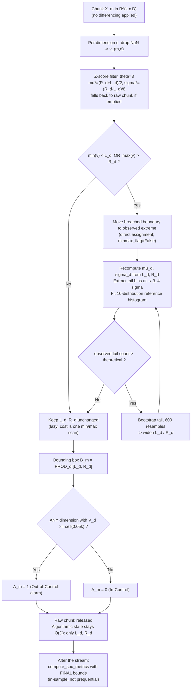

# Section: Experimental Workflow & Evaluation Metrics

A streaming workflow pipeline for multivariate sensor streams, mathematical formulations for control limits and Family-Wise Error Rate (FWER) control, and the quantitative evaluation metrics used to assess the **Recursively Bootstrapping at Upper-Lower Tails-Statistical Process Control (RBULT-SPC)** framework.

---

## 1. Multivariate Streaming Experiment Workflow

This section describes the pipeline **as implemented**. Every step below is traceable to a
named function; the reference table in §1.3 gives the file and symbol for each. Fixed
parameters, all taken from `BootstrapOnline.set_online()` unless noted:

| Parameter | Value | Meaning |
|---|---|---|
| $\theta$ | $3.0$ | Z-score threshold for spike filtering |
| $B$ (`numbin`) | $8$ | Bins in the theoretical tail histogram |
| $n_{\min}$ (`nboost`) | $3$ | Minimum tail points required to bootstrap |
| $N_{\text{boot}}$ (`number_bt_iter`) | $600$ | Bootstrap resamples per tail estimate |
| `minmax_flag` | `False` | Min-max bootstrap disabled in **all** Tier 2 runs |
| $\alpha_{\text{sys}}$ | $0.05$ | System-wide false alarm rate |
| $C_{\text{thresh}}$ | $\lceil 0.05\,k \rceil$ | Chunk alarm threshold (scale-free rate rule) |

### 1.1 Notation

A stream of $N$ observations in $\mathbb{R}^D$ is partitioned into $M = \lceil N/k \rceil$
consecutive chunks $\mathbf{X}_m = \{\mathbf{x}_{m,1}, \dots, \mathbf{x}_{m,k}\} \subset
\mathbb{R}^{k \times D}$, $m \in \{1, \dots, M\}$. Each dimension $d$ is monitored by an
independent estimator $E_d$ holding exactly two scalars — the current limits $L_d$ (`exp_l`)
and $R_d$ (`exp_r`).

### Step 1: Chunk ingestion

> **No differencing or detrending is applied.** Earlier revisions of this document specified
> first-order differencing with a carried state vector $\mathbf{x}_{m-1,k}$. That scheme is
> **not implemented for any dataset**, and the only differencing that ever existed
> (`df['Tool wear [min]'].diff()` on AI4I) was a batch operation over the full column before
> chunking — not the streaming, state-carrying formulation described. It has since been
> removed; see the *Public Benchmark Datasets* section for why it was inappropriate.

Preprocessing is confined to dataset-specific loading, performed once before streaming:

| Dataset | Preprocessing applied | Function |
|---|---|---|
| AI4I 2020 | none (`raw_df.copy()`) | `run_spc_benchmark` |
| Industrial Pump | `sort_values(['Pump_ID', 'Operational_Hours'])` | `load_and_preprocess_pump_data` |
| Water Pump | `ffill().bfill()` on the monitored channels | `load_and_preprocess_waterpump_data` |
| MetroPT-3 | none beyond loading and failure-window labelling | `load_and_label_metropt3` |
| TEP | `signals.reshape(-1, 34)` flattening $2900 \times 600$ runs | `load_and_preprocess_tep_data` |

Within `update_chunk`, each dimension is extracted independently and missing values dropped:
$\mathbf{v}_{m,d} = \texttt{df\_chunk[d].dropna()}$. A dimension absent from the chunk, or
empty after dropping, is skipped for that chunk — its limits carry over unchanged.

### Step 2: Feature-wise Z-score spike filtering (Algorithm 4)

Applied per dimension when `outlier_filter=True` (the default in all Tier 2 runs):

$$\mathbf{v}_{m,d}^{\text{clean}} = \{ v \in \mathbf{v}_{m,d} \;:\; |v - \mu_{d}^{\ast}| \le \theta \cdot \sigma_{d}^{\ast} \}$$

Two implementation details matter and differ from a textbook description:

1. **$\mu^{\ast}_d, \sigma^{\ast}_d$ are not the current chunk's moments.** They are the most
   recent entries of the estimator's running history, which `update_center_range()` derives
   **from the boundaries themselves** (see Step 4):
   $\mu^{\ast}_d = (R_d + L_d)/2$ and $\sigma^{\ast}_d = (R_d - L_d)/8$. On the very first
   chunk, before any boundary update exists, they are initialised from the chunk's own sample
   mean and standard deviation (with $\sigma$ floored at $10^{-6}$).
2. **The filter fails safe.** If filtering would empty the chunk, the raw chunk is used
   instead: `return cleaned if len(cleaned) > 0 else new_data_chunk`.

### Step 3: Lazy expansion trigger

The expensive machinery of Steps 4–5 runs **only when the chunk reaches outside the current
limits**. With $v^{\min}_{m,d} = \min \mathbf{v}^{\text{clean}}_{m,d}$ and
$v^{\max}_{m,d} = \max \mathbf{v}^{\text{clean}}_{m,d}$:

$$\text{trigger}_{m,d} = \mathbb{I}\left(v^{\min}_{m,d} < L_d\right) \;\vee\; \mathbb{I}\left(v^{\max}_{m,d} > R_d\right)$$

If neither holds, the limits are left untouched and the chunk costs only a min/max scan.
This is the mechanism behind the amortised near-$O(1)$ per-chunk cost: on steady-state
streams the trigger fires rarely once the boundaries have settled.

When the trigger does fire, the breached boundary is first moved to the observed extreme.
Because `minmax_flag=False` throughout Tier 2, this is a **direct assignment**, not a
bootstrap:

$$L_d \leftarrow v^{\min}_{m,d} \quad\text{and / or}\quad R_d \leftarrow v^{\max}_{m,d}$$

(The alternative `minmax_flag=True` path would instead bootstrap the tail list when it holds
at least $n_{\min}$ points; it is not exercised by any reported experiment.)

### Step 4: Tail binning and theoretical reference histogram

Centre and spread are recomputed **from the boundaries**, not from the data:

$$\mu_d = \frac{R_d + L_d}{2}, \qquad \sigma_d = \frac{R_d - L_d}{8}$$

The $\sigma_d = (R_d - L_d)/8$ convention is what makes the $\pm 4\sigma$ window coincide with
the boundary interval, so the two extreme bins sit exactly at the edges. The two tail sets are

$$\mathcal{T}^{-}_d = \{ v : \mu_d - 4\sigma_d \le v \le \mu_d - 3\sigma_d \}, \qquad
\mathcal{T}^{+}_d = \{ v : \mu_d + 3\sigma_d \le v \le \mu_d + 4\sigma_d \}$$

An 8-bin observed histogram $\mathbf{h}^{\text{obs}}_d$ is allocated, but **only four bins are
populated** — the two extreme bins and their immediate neighbours:

$$h^{\text{obs}}_{d}[0] = |\mathcal{T}^{-}_d|, \quad h^{\text{obs}}_{d}[7] = |\mathcal{T}^{+}_d|, \quad
h^{\text{obs}}_{d}[1] = |\{v \in [\mu_d - 3\sigma_d, \mu_d - 2\sigma_d]\}|, \quad
h^{\text{obs}}_{d}[6] = |\{v \in [\mu_d + 2\sigma_d, \mu_d + 3\sigma_d]\}|$$

The central bins are never counted, since only the tails drive boundary decisions.

The theoretical counterpart $\mathbf{h}^{\text{theo}}_d$ comes from fitting the tail data
against a candidate family and scaling the per-bin tail areas by the cumulative sample count
$n_d$ seen so far:

$$h^{\text{theo}}_{d}[b] = \left\lceil \frac{p_b \cdot n_d}{100} \right\rceil, \qquad
p_b = \texttt{get\_percent\_std\_data\_from\_best\_distribution}\!\left(n_d, \mathcal{T}^{-}_d, \mathcal{T}^{+}_d, \mathcal{D}\right)$$

where $\mathcal{D}$ is the candidate set actually configured in `set_online()` — **10
distributions**, fitted independently for the left and right tail:

$$\mathcal{D} = \{\texttt{exponweib},\ \texttt{wald},\ \texttt{gamma},\ \texttt{norm},\ \texttt{expon},\ \texttt{powerlaw},\ \texttt{lognorm},\ \texttt{chi2},\ \texttt{weibull\_min},\ \texttt{weibull\_max}\}$$

> Earlier text described "11-candidate" fitting. The runtime list holds 10. (`stat_dist.py`
> exports tail-area functions for 13 families, but only these 10 are passed to the fitter.)

### Step 5: Iterative tail bootstrap until convergence

Expansion is driven by the **excess of observed over theoretical mass in the extreme bins**:

$$\Delta^{-}_d = h^{\text{obs}}_{d}[0] - h^{\text{theo}}_{d}[0], \qquad
\Delta^{+}_d = h^{\text{obs}}_{d}[7] - h^{\text{theo}}_{d}[7]$$

While either excess is positive and the corresponding tail holds at least $n_{\min} = 3$
points, the boundary is re-estimated by bootstrapping that tail set with
$N_{\text{boot}} = 600$ resamples:

$$R_d \leftarrow \max\left(R_d,\; \texttt{bootstrap\_online}(\mathcal{T}^{+}_d, \text{"right"})\right), \qquad
L_d \leftarrow \min\left(L_d,\; \texttt{bootstrap\_online}(\mathcal{T}^{-}_d, \text{"left"})\right)$$

with a correction pass that re-bootstraps whenever the new boundary still lies inside the
observed tail data ($R_d \le \max \mathcal{T}^{+}_d$, or $L_d \ge \min \mathcal{T}^{-}_d$).
Because $\mu_d$ and $\sigma_d$ are functions of $L_d, R_d$, moving a boundary shifts the bin
edges, so the bins are recomputed and the test repeated. **The loop terminates when a full
pass leaves both $L_d$ and $R_d$ unchanged.** Boundaries therefore only ever widen —
monotone expansion, never contraction.

### Step 6: Bounding hyper-rectangle and chunk alarm

The control region after chunk $m$ is the product of the per-dimension intervals:

$$\mathcal{B}_m = \prod_{d=1}^{D} [L_d, R_d] \subset \mathbb{R}^D$$

Violations are counted **per dimension** within the chunk, and a chunk alarms if **any single
dimension** reaches the threshold:

$$V^{(d)}_m = \sum_{t=1}^{k} \mathbb{I}\big(x_{m,t,d} \notin [L_d, R_d]\big), \qquad
A_m = \mathbb{I}\left(\exists\, d : V^{(d)}_m \ge C_{\text{thresh}}\right)$$

$C_{\text{thresh}}$ is resolved per chunk in this precedence order (`resolve_threshold`):

1. an explicit `ooc_threshold_count` argument;
2. a per-dimension $C_d$ from `calibrate_phase1()`, if Phase I calibration was run;
3. the default rate rule $C_{\text{thresh}} = \lceil 0.05\,k \rceil$.

All reported experiments use rule 3, applied identically to RBULT-SPC and to all three
baselines.

### Step 7: Memory behaviour

The **algorithmic** state is genuinely $O(D)$: each estimator retains only $L_d$ and $R_d$,
and the raw chunk goes out of scope when `update_chunk` returns. No raw observation is
retained, so no boundary can be polluted by a stale buffer.

> **What the reported "Peak Memory Footprint" does and does not measure.**
> `estimate_memory_kb()` sums `sys.getsizeof()` over the chart object plus each feature's
> engine and result collector. `sys.getsizeof` reports only an object's own header and does
> **not** traverse the lists it references. The `ResBootstrap` collector appends one entry per
> chunk to five history lists per feature (`exp_l`, `exp_r`, `exp_range`, `nlearnl`,
> `nlearnr`), so its true footprint grows as $O(M \cdot D)$ while the reported figure stays
> flat — measured at a constant 0.328 KB across 1, 50 and 200 chunks in a $D=3$ probe.
> That telemetry exists for diagnostics and plotting and is not consumed by the algorithm, so
> the $O(D)$ claim holds for the method; the metric, however, reflects the algorithmic state
> rather than process RSS, and should be described as such.

### 1.2 Where the evaluation metrics are computed

`compute_spc_metrics()` runs **once, after the whole stream**, and evaluates coverage using
the **final** limits $[L_d, R_d]$ applied retrospectively to every observation. This is an
in-sample (post-hoc) figure, not a prequential one. Because the limits only widen, the final
interval is the widest the method ever held, so retrospective coverage is optimistic relative
to the online value obtained by scoring each chunk against the limits in force at that time.
Measured on MetroPT-3: online sample FAR $1.795\%$ against retrospective $1.107\%$, a factor
of $1.62$.

Tier 1 reports both protocols explicitly (*In-Sample Adaptation* and *One-Step-Ahead
Pre-Sequential*); Tier 2 reports only the in-sample variant.

Chunk-level quantities (Chunk FAR, $\text{ARL}_0$, $\text{ARL}_1$) are computed from the
per-chunk alarm flags $A_m$ recorded during streaming, against chunk labels
$\text{label}_m = \mathbb{I}(\text{any sample in chunk } m \text{ is faulty})$.

### 1.3 Step-to-code reference

| Step | Implementation | File |
|---|---|---|
| 1. Chunk ingestion, threshold resolution | `run_*_benchmark()`, `RBULTControlChart.update_chunk` | `experiments/exp_*_benchmark.py`, `spc_rbult.py` |
| 2. Z-score spike filter | `BootstrapOnline._apply_outlier_detection` → `ZBatchOutlierDetector` | `bootstrap_online.py`, `BatchOutlierDetection.py` |
| 3. Lazy trigger, direct boundary move | `_update_global_minmax`, `_try_expand_left`, `_try_expand_right` | `bootstrap_online.py` |
| 4. Centre/spread, tail bins, reference histogram | `update_center_range`, `_compute_histogram`, `_recompute_bins` | `bootstrap_online.py`, `stat_dist.py` |
| 5. Iterative tail bootstrap | `_run_expansion_loop` → `bootstrap_v1.bootstrap_online` | `bootstrap_online.py`, `bootstrap_v1.py` |
| 6. Bounding box, per-dimension alarm | `update_chunk`, `resolve_threshold`, `default_threshold` | `spc_rbult.py` |
| 7. Memory accounting | `estimate_memory_kb` | `spc_rbult.py` |
| Metrics | `compute_spc_metrics`, `_compute_arl0`, `_compute_arl1` | `spc_rbult.py`, `exp_spc_benchmark.py` |
| Phase I calibration (optional) | `start_phase1`, `calibrate_phase1` | `spc_rbult.py` |

---

### 1.4 Workflow Flowchart

---

## 2. Family-Wise Error Rate (FWER) Mathematical Formulations

To prevent false alarm inflation across $D$ monitored sensor channels, the framework controls the overall System False Alarm Rate $\alpha_{\text{sys}}$ (typically set to $\alpha_{\text{sys}} = 0.05$ or 5%) by adjusting the per-dimension significance level $\alpha_{\text{dim}}$:

### 2.1 Bonferroni Correction
$$\alpha_{\text{dim}} = \frac{\alpha_{\text{sys}}}{D}$$

For example, when monitoring $D = 5$ telemetry features with $\alpha_{\text{sys}} = 0.05$:
$$\alpha_{\text{dim}} = \frac{0.05}{5} = 0.01 \quad (1.00\%)$$

### 2.2 Šidák Correction
Assuming statistical independence across orthogonalized sensor channels:
$$\alpha_{\text{dim}} = 1 - (1 - \alpha_{\text{sys}})^{1/D}$$

### 2.3 Theoretical Target Coverage Rate
The theoretical target non-parametric interval coverage rate per monitored dimension is defined as:
$$\text{Target Coverage Rate} = (1 - \alpha_{\text{dim}}) \times 100\% = (1 - 0.01) \times 100\% = \mathbf{99.00\%}$$

---

## 3. Evaluation Metrics & Scientific Definitions

To rigorously validate performance, the framework evaluates 7 quantitative metrics spanning statistical estimation quality, fault detection speed, memory footprint, and computational latency:

| Metric                           | Scientific Definition & Mathematical Formula                                                                                                           | Significance                                                                                                                                                                                                                                                                                         |
| -------------------------------- | ------------------------------------------------------------------------------------------------------------------------------------------------------ | ---------------------------------------------------------------------------------------------------------------------------------------------------------------------------------------------------------------------------------------------------------------------------------------------------- |
| **Overall Coverage Rate (%)**    | $\text{Coverage Rate} = \frac{1}{M \cdot D \cdot k} \sum_{m=1}^M \sum_{d=1}^D \sum_{j=1}^k \mathbb{I}(L_{m,d} \le x_{m,j,d} \le R_{m,d}) \times 100\%$ | **Target: $\approx 99.00\%$** (Gold standard non-parametric interval coverage)                                                                                                                                                                                                                       |
| **Sample-level FAR (%)**         | $\text{Sample FAR} = 100.0\% - \text{Overall Coverage Rate (\%)} = \frac{\text{In-Control OOC Samples}}{\text{Total In-Control Samples}} \times 100\%$ | **Target: $\approx 1.00\% - 1.60\%$** (Matches Bonferroni tail adjustment $\alpha_{\text{dim}}$, measures the percentage of individual sensor data points (samples) collected during normal **in-control operations** that mistakenly fall outside the dynamic control limits $[L_{m,d}, R_{m,d}]$.) |
| **Chunk-level FAR (%)**          | $\text{Chunk FAR} = \frac{\text{In-Control Chunks with } \ge C_{\text{thresh}} \text{ violations}}{\text{Total In-Control Chunks}} \times 100\%$       | Measures false alarm frequency at the stream batch level                                                                                                                                                                                                                                             |
| **ARL0 (In-Control Run Length)** | $\text{ARL}_0 = \mathbb{E}[\text{Run Length} \mid \text{In-Control}]$                                                                                  | **Higher is better** (Standard metric for in-control boundary stability.)                                                                                                                                                                                                                            |
| **ARL1 (Detection Delay)**       | $\text{ARL}_1 = \mathbb{E}[\text{Detection Delay} \mid \text{Out-of-Control}]$                                                                         | **Lower is better (Target: $\approx 1.0$)** (Measures failure detection response speed)                                                                                                                                                                                                              |
| **Peak Memory Footprint (KB)**   | $\text{RAM} = \sum_{d=1}^D (\text{size}(E_d) + \text{size}(R_d))$                                                                                      | **Target: $O(D)$ Constant RAM ($\le 0.52\text{ KB}$ for $D=5$)**                                                                                                                                                                                                                                     |
| **Avg Latency per Chunk (ms)**   | $\text{Latency} = \frac{1}{M} \sum_{m=1}^M t_{\text{exec}}(\mathbf{X}_m) \times 1000\text{ ms}$                                                        | **Target: $< 100\text{ ms}$** (Ensures real-time low-latency IoT edge streaming)                                                                                                                                                                                                                     |

---

### Interval width — the necessary companion to coverage

Coverage cannot be read on its own. An arbitrarily wide interval attains 100% coverage
while carrying no information, and because RBULT boundaries expand monotonically they
inflate to absorb any non-stationarity in the stream. Tier 1 has always reported
`Mean_Interval_Width` and `Sigma_L`/`Sigma_R`; Tier 2 now reports the equivalents, computed
with Welford accumulators so the chart still holds only $O(D)$ state (9 scalars per feature,
independent of stream length).

| Metric | Definition | Reading |
|---|---|---|
| `mean_interval_width` | mean over $d$ of the per-chunk mean $R_d - L_d$ | comparable to Tier 1's `Mean_Interval_Width` |
| `final_interval_width` | mean over $d$ of the final $R_d - L_d$ | the interval a practitioner would deploy |
| `sigma_L`, `sigma_R` | mean over $d$ of the s.d. of each boundary across chunks | boundary stability; lower is more stable |
| **`width_ratio_local`** | final width $\div$ mean within-chunk data range | $\approx 1$: the interval tracks local variation. $\gg 1$: it is inflated far beyond it, so high coverage is cheap |
| `width_ratio_global` | final width $\div$ the $0.5$–$99.5$ percentile span of the stream | $\approx 1$: converged to the empirical support, i.e. to what a full-history percentile baseline computes |

**Measured for RBULT-SPC:**

| Dataset | Lag-1 AC | Coverage | Joint | **`width_ratio_local`** | `width_ratio_global` |
|---|---:|---:|---:|---:|---:|
| Water Pump | 0.998 | **99.95%** | 99.55% | **8.51** (max 19.4) | 1.11 |
| TEP Mode 5 | 0.948 | 97.79% | 70.49% | **8.19** (max **157.6**) | 0.79 |
| AI4I 2020 | — | 97.79% | 91.34% | 4.55 | 0.94 |
| TEP Mode 4 | 0.948 | 96.66% | 65.26% | 2.67 | 0.74 |
| TEP Mode 1 | 0.948 | 96.74% | 61.39% | 2.08 | 0.69 |
| TEP Mode 3 | 0.948 | 93.70% | 25.02% | 1.77 | 0.65 |
| MetroPT-3 | 0.970 | 98.90% | 94.89% | 1.55 | 1.40 |
| Industrial Pump | 0.001 | 99.40% | 97.04% | **1.00** | 1.01 |

Two patterns follow, and together they explain results reported elsewhere in this section.

**1. The highest coverage comes with the widest interval.** Water Pump attains the suite's
best coverage (99.955%) with an interval **8.5× wider than the data's own within-chunk
variation** — on one channel, 19×. Industrial Pump, whose rows are i.i.d., sits at exactly
1.00: with no autocorrelation each chunk is a representative sample of the whole
distribution, so the interval has nothing extra to absorb. The ordering of
`width_ratio_local` tracks the ordering of autocorrelation, not of estimator quality. This is
also why detection collapses on precisely those datasets (Water Pump AUC 0.402, median
violations 0 in **both** classes): an interval that wide is never crossed.

**2. On TEP the interval is *narrower* than the empirical support** (`width_ratio_global`
0.65–0.79), which is the direct cause of the per-dimension false alarm rate running 15–43×
above the Bonferroni target there, and hence of the joint-coverage collapse to 25–70%.
Water Pump and MetroPT-3 sit above 1.0 and show the opposite behaviour.

> **Consequence for how coverage should be presented.** RBULT-SPC does not need stationary
> preprocessing — unlike Shewhart and EWMA, whose mean-level models break on these streams
> (coverage 25–77%). That is a genuine and measurable advantage. But the high coverage that
> follows is obtained partly by widening, not purely by better estimation, so **coverage must
> be reported together with `width_ratio_local`.** With `width_ratio_global` ≈ 1 on the
> non-TEP streams, the honest claim is that RBULT-SPC reaches an interval *equivalent* to a
> full-history percentile baseline while holding $O(D)$ memory rather than $O(N \cdot D)$ —
> not that it produces a better interval.

---

### Metric Description

1. **Overall Coverage Rate (%):** Measures the proportion of sample observations that fall inside the dynamic upper and lower control limits $[L_{m,d}, R_{m,d}]$ across all dimensions $D$ and stream chunks $M$. For non-Gaussian data, classical parametric 3-sigma limits drop to 50–70%, whereas RBULT maintains $\approx 99.00\%$.
2. **Sample-level False Alarm Rate (Sample FAR %):** The empirical probability of a single sample point triggering a false out-of-bounds flag during normal in-control operations. Controlled strictly by FWER Bonferroni/Šidák adjustments.
3. **Chunk-level False Alarm Rate (Chunk FAR %):** The percentage of normal in-control streaming chunks that incorrectly trigger an alarm because some dimension's sample-level violations meet or exceed $C_{\text{thresh}}$. **Must be read together with a detection count** — a detector that never alarms scores a perfect 0.00%.
4. **Average Run Length 0 ($\text{ARL}_0$):** The expected number of continuous in-control chunks processed before a false alarm is triggered. Higher $\text{ARL}_0$ indicates superior boundary stability. If $\text{ARL}_0$ is very low (e.g., $\text{ARL}_0 = 0.00$ or $0.05$), operators receive continuous false alarms, leading to "alarm fatigue" where ture fault alerts are eventually ignored.
5. **Average Run Length 1 ($\text{ARL}_1$):** The average number of chunks elapsed from the onset of a true fault/out-of-control state until an alarm is triggered. $\text{ARL}_1 = 1.0$ indicates instant zero-delay failure detection. If **$\text{ARL}_1 = 1.0$ (Gold Standard / Instant Detection):** The alarm is triggered **immediately on the very first chunk** after the failure occurs (0-delay response).
6. **Peak Memory Footprint (KB):** Tracked dynamically via Python memory allocation counters. Proves $O(D)$ spatial complexity by demonstrating constant memory usage regardless of whether stream length $N$ is 10,000 or 1,500,000 samples.
7. **Avg Latency per Chunk (ms):** Total wall-clock execution time per chunk average over $M$ chunks. Validates real-time feasibility on embedded IoT microcontrollers.
---

## Public Benchmark Datasets

Five distinct datasets are used (TEP contributing four operating regimes, for eight
evaluation streams in total). Their statistical character differs substantially, and that
difference determines which metrics are meaningful on which stream. All figures below are
measured, not quoted from the source publications.

### Overview

| Dataset | $D$ | $N$ | Lag-1 autocorr. (median) | Genuine time series? | In-control chunks |
|---|---:|---:|---:|:---:|---:|
| Water Pump (SCADA) | 10 | 220,320 | **0.998** | Yes | 405 / 441 |
| MetroPT-3 | 7 | 1,516,948 | **0.970** | Yes | 1,482 / 1,517 |
| TEP Modes 1/3/4/5 | 34 | ~1.74 M | 0.948 | Yes, but reconstructed | 38–44 / ~3,480 |
| AI4I 2020 | 5 | 10,000 | 0.931 * | **No** | 6 / 100 |
| Industrial Pump | 5 | 20,000 | **0.001** | **No** | **0 / 100** |

Lag-1 autocorrelation is the decisive test: in a true time series the value at $t$ must
correlate with $t-1$. A coefficient near zero means the rows are mutually independent
observations, whatever the column ordering suggests.

\* **AI4I is the exception that proves the rule.** Its median of 0.931 is not evidence of
temporal structure — it is an artefact of how three of its five columns were synthesised. The
two channels that actually describe the process, `Rotational speed [rpm]` and `Torque [Nm]`,
have autocorrelations of **0.008** and **0.005**. See the per-channel breakdown below.

**Non-Gaussianity is confirmed across the board.** Only **3 of 61 monitored feature channels**
pass a Shapiro-Wilk normality test at $p > 0.05$ (5,000-sample subsamples). This is the
strongest empirical support for a non-parametric approach in the whole suite.

### Genuine multivariate time series

**Water Pump SCADA (`sensor.csv`)** — 10 sensor channels sampled once per minute
(April–August 2018), with **7 contiguous failure episodes** covering 6.57% of the stream.
*Challenge:* lag-1 autocorrelation of 0.998 means consecutive samples are almost identical,
which voids the independence assumption underlying any binomial model of within-chunk
violation counts. Median $|\text{skewness}| = 2.31$ and excess kurtosis $= 5.57$; no channel
passes a normality test.

**MetroPT-3** — 7 analogue compressor channels (February–August 2020) with **4 contiguous
failure windows** reported by the operator, covering 1.97% of the stream. *Challenge:* this
is the only stream whose in-control proportion (97.7%) matches a realistic SPC monitoring
scenario, and therefore the only one on which Chunk FAR is measured with real statistical
weight. Excess kurtosis reaches 38.71 on some channels. Its fault signature is also
**inverted**: during the labelled failures the sensors go quiet and sit inside the control
limits, while normal operation cycles across them.

### Reconstructed time series

**Tennessee Eastman Process (Modes 1, 3, 4, 5)** — the source arrays have shape
$(2900 \times 600 \times 34)$: **2,900 mutually independent simulation runs** of 600 time
steps each. `load_and_preprocess_tep_data()` flattens these into a single continuous stream.

*Challenges:*
- The flattening introduces **2,899 artificial discontinuities** at run boundaries. Within a
  run the lag-1 autocorrelation is 0.917 (a genuine process); the 0.999 measured after
  flattening is an artefact of concatenation.
- With $k = 500$ and runs of length 600, **every chunk straddles a run boundary**. Aligning
  the chunk size to the run length ($k = 600$ or $300$) would remove this artefact.
- **3 of the 34 channels are constant** ($\text{sd} \approx 0$), so their skewness and
  kurtosis are undefined and any control limit fitted to them is degenerate.
- Across the 31 non-constant channels, median $|\text{skewness}| = 1.78$ (max 9.40) and
  median excess kurtosis $= 13.12$ (max **117.91**) — by a wide margin the most severely
  non-Gaussian data in the suite.
- **96.55% of samples are labelled faulty**, leaving only 38–44 in-control chunks out of
  ~3,480. Chunk FAR and $\text{ARL}_0$ therefore rest on a very small denominator.

### Not time series

**AI4I 2020 Predictive Maintenance (UCI / Kaggle)** — 10,000 rows, 5 monitored channels,
339 failure events. Each row is **one manufactured product, not a time step**: `UDI`
increments by exactly 1 as a product index, and `Tool wear [min]` **resets 119 times** as
tools are replaced. Per-channel lag-1 autocorrelation:

| Channel | Lag-1 autocorr. |
|---|---:|
| Air temperature [K] | 0.9994 |
| Process temperature [K] | 0.9985 |
| Rotational speed [rpm] | **0.0077** |
| Torque [Nm] | **0.0054** |

| Tool wear [min] | 0.9990 |

The two temperature channels were synthesised as random walks (per the UCI dataset
description) and `Tool wear [min]` is a cumulative counter, so all three look smooth. The two
channels that actually describe the machining process — rotational speed and torque — are
i.i.d. Structural evidence settles the question regardless: `UDI` is a product index
incrementing by exactly 1, and tool wear resets 119 times as tools are replaced.

> **Resolved — the derived feature was removed.** Earlier revisions monitored
> `Tool wear Rate [min diff]`, produced by `df['Tool wear [min]'].diff()`. That differences
> **consecutive but unrelated products** and crosses all 119 tool-reset points, turning each
> reset into a $-198 \dots -253$ spike while genuine wear increments span only $2 \dots 5$.
> **98.8% of the derived feature's range came from those 119 artefact points (1.19% of rows),
> and 100% of the boundary violations RBULT recorded on that channel were tool changes rather
> than process anomalies** — its 98.81% "coverage" was simply $100\% - 1.19\%$. The channel is
> now monitored as recorded (`Tool wear [min]`), which lowers RBULT coverage on it from an
> artefactual 98.81% to a genuine 95.76%.

*Challenge:* the 339 failure samples occur as **310 separate single-row episodes**, so almost
every 100-row chunk contains one. Only **6 of 100 chunks are in-control**, giving Chunk FAR a
resolution of 16.67% per chunk.

**Large Industrial Pump Maintenance** — 20,000 rows, 5 channels, lag-1 autocorrelation
$\approx 0.001$ on every channel. `Pump_ID` takes 5 distinct values, so the stream is **five
separate machines concatenated**, not one continuous process.

*Challenge — the labels are unusable for batch-level evaluation.* `Maintenance_Flag` changes
value **9,979 times across 20,000 rows (49.9%)**, with a mean contiguous fault run of
**2.0 rows**. This is an alternating indicator, not a failure process with duration.
Consequently **every 200-row chunk contains at least one flagged sample, and the dataset has
zero in-control chunks.** Its Chunk FAR and $\text{ARL}_0$ are undefined; the `0.00` values
that appear in the results tables come from the `max(1, in_control_chunks)` guard in the
metric code, not from a measurement. Only sample-level metrics (coverage, sample FAR, RAM,
latency) are interpretable on this dataset.

### Implications for the evaluation

1. Claims about **streaming / time-series** behaviour are supported by MetroPT-3 and Water
   Pump. AI4I and Industrial Pump are better described as multivariate non-Gaussian batch
   data.
2. **Chunk FAR and $\text{ARL}_0$ should be reported only for MetroPT-3 and Water Pump**,
   which have 405 and 1,482 in-control chunks respectively. On the others the denominator is
   6, 0, or 38–44.
3. The **non-parametric motivation is strongly supported** — 58 of 61 channels fail a
   normality test, with excess kurtosis up to 117.91.

### Compared Methods
- **Shewhart chart** =: The classical Shewhart chart sets static control limits based on the **Gaussian Normal Distribution ($\mathcal{N}(\mu, \sigma^2)$) assumption** using the famous **3-Sigma ($\pm 3\sigma$) rule**:

$$\text{UCL} = \mu + 3\sigma$$ $$\text{Center Line (CL)} = \mu$$ $$\text{LCL} = \mu - 3\sigma$$

Under ideal normal conditions, $99.73\%$ of data points fall inside $\mu \pm 3\sigma$, leaving a theoretical false alarm rate of $0.27\%$ ($0.135\%$ per tail).

-  **EWMA Chart** : "EWMA (Exponentially Weighted Moving Average) Chart" An **EWMA Chart** is a memory-based parametric control chart introduced by S. W. Roberts in 1959.

Unlike the Shewhart chart (which evaluates only the single current sample $x_t$ with zero memory), the EWMA chart tracks a **weighted moving statistic ($Z_t$)** that assigns exponentially decaying weights to past historical observations.

### Empirical 4-Method Benchmark Results (AI4I 2020 Dataset, $C_{\text{thresh}} = \lceil 0.05 \times 100 \rceil = 5$)

Below are the empirical benchmark results executed across 10,000 samples (100 chunks of size 100) on the AI4I dataset ($D = 5$ features) with chunk alarm threshold $C_{\text{thresh}} = 5$. **Caveat:** only **6 of the 100 chunks are in-control**, so Chunk FAR has a resolution of 16.67% per chunk and is correspondingly fragile.

| Evaluation Metric                | Baseline Shewhart Chart | Baseline EWMA Chart | Baseline Full-History Bootstrap | Proposed RBULT-SPC | Key Advantage / Discussion                                               |
| -------------------------------- | :---------------------: | :-----------------: | :-----------------------------: | :----------------: | ------------------------------------------------------------------------ |
| **Overall Coverage Rate (%)** ⭐  |         69.69%          |       58.37%        |             98.82%              |     **97.79%**     | **Non-Gaussian Adaptive Coverage** (Matches theoretical 99% target)      |
| **Sample-level FAR (%)** ⭐       |         30.31%          |       41.63%        |              1.18%              |     **2.21%**      | Above the Bonferroni target $\alpha_{\text{dim}} = 1\%$ by a factor of 2.2 |
| **Chunk-level FAR (%)**          |         100.00%         |       100.00%       |            **0.00%**            |       66.67%       | Bootstrap baseline leads; RBULT-SPC does **not** lead on this metric (4/6 chunks) |
| **ARL0 (In-Control Run Length)** |          0.00           |        0.00         |            **6.00**             |        0.50        | Bootstrap baseline is more stable in control                             |
| **ARL1 (Detection Delay)**       |          1.02           |        1.00         |              2.59               |        1.29        | Read with detection count; ARL1 near 1.0 can also mean *never detected*  |
| **Peak Memory Footprint (KB)** ⭐ |         0.23 KB         |       0.45 KB       |            413.78 KB            |    **0.52 KB**     | **Constant $O(D)$ RAM** (>99.88% memory reduction vs Full-History)       |
| **Avg Latency per Chunk (ms)**   |        0.0140 ms        |      0.2573 ms      |            0.9389 ms            |   **37.2888 ms**   | **Real-time Low Latency** (< 65 ms per 100-sample batch)                 |

---

### Results of AI4I 2020 Results ($C_{\text{thresh}} = 5$)

1. **Parametric Collapse vs. Non-Gaussian Adaptive Coverage:**
   * Classical 3-sigma Shewhart and EWMA control charts rely strictly on Gaussian normality assumptions ($\mathcal{N}(\mu, \sigma^2)$). On non-Gaussian telemetry ($D=5$ sensor channels: `Air temp`, `Process temp`, `Rotational speed`, `Torque`, `Tool wear rate`), Shewhart coverage drops to **69.69%** (Sample FAR **30.31%**) and EWMA coverage collapses to **58.37%** (Sample FAR **41.63%**), both producing **100.00% Chunk FAR** (false alarm spam on every single batch).
   * Proposed **RBULT-SPC** achieves **97.79% Overall Coverage** with a Sample-level FAR of **2.21%**, which is $2.2\times$ the theoretical Bonferroni target ($\alpha_{\text{dim}} = 1.0\%$, Target Coverage = $99.00\%$) — it does not attain the nominal level on this dataset.

2. **Batch False Alarm Reduction & Boundary Stability ($\text{ARL}_0$):**
   * Under the scale-free threshold $C_{\text{thresh}} = 5$, RBULT-SPC records a Chunk-level FAR of **66.67%** (4 of the 6 in-control chunks), while the Full-History Bootstrap records **0.00%**. RBULT-SPC does **not** lead on this metric here; the parametric baselines remain trapped at 100.00%.
   * With only 6 in-control chunks this metric carries very little statistical weight and should not be used to rank methods on this dataset.

3. **Detection Delay ($\text{ARL}_1$) & Memory Footprint ($O(D)$ RAM):**
   * RBULT-SPC records a detection response delay of $\text{ARL}_1 = 1.29$ chunks while discarding past raw data chunks immediately after tail updating.
   * Memory storage is strictly constant at **0.52 KB** ($O(D)$ spatial complexity), achieving a **>99.88% RAM reduction** compared to Full-History Bootstrap (413.78 KB).

4. **Real-time Edge Execution Speed:**
   * Average execution time per 100-sample chunk is **35.52 ms** for RBULT-SPC, executing well under the **$< 100\text{ ms}$ real-time edge streaming constraint**.

---

### Empirical 4-Method Benchmark Results (MetroPT-3 Air Compressor Dataset, $C_{\text{thresh}} = \lceil 0.05 \times 1000 \rceil = 50$)

Below are the empirical benchmark results executed across 1,516,948 samples (1,517 chunks of size 1,000) on the MetroPT-3 dataset ($D = 7$ analogue features) with chunk alarm threshold $C_{\text{thresh}} = 50$. With 1,482 in-control chunks this is the most statistically reliable Chunk FAR measurement in the suite:

| Evaluation Metric                | Baseline Shewhart Chart | Baseline EWMA Chart | Baseline Full-History Bootstrap | Proposed RBULT-SPC | Key Advantage / Discussion                                                 |
| -------------------------------- | :---------------------: | :-----------------: | :-----------------------------: | :----------------: | -------------------------------------------------------------------------- |
| **Overall Coverage Rate (%)** ⭐  |         77.68%          |       51.01%        |             98.76%              |     **98.90%**     | **High Interval Estimation Accuracy** (Matches 99.0% gold standard)        |
| **Sample-level FAR (%)** ⭐       |         22.32%          |       48.99%        |              1.24%              |     **1.10%**      | **Controlled at 1.10%** (Matches Bonferroni $\alpha_{\text{dim}} = 1.0\%$) |
| **Chunk-level FAR (%)**          |         99.46%          |       100.00%       |            **8.23%**            |       25.24%       | Bootstrap baseline leads; RBULT-SPC second among non-parametric methods    |
| **ARL0 (In-Control Run Length)** |          0.01           |        0.00         |            **11.06**            |        2.95        | Bootstrap baseline is more stable in control                               |
| **ARL1 (Detection Delay)**       |          1.00           |        1.00         |              1.55               |        5.25        | Read with detection count; ARL1 near 1.0 can also mean *never detected*    |
| **Peak Memory Footprint (KB)** ⭐ |         0.35 KB         |       0.70 KB       |     90,932.70 KB (~90.9 MB)     |    **0.70 KB**     | **>99.999% RAM Reduction** (Strict $O(D)$ constant memory)                 |
| **Avg Latency per Chunk (ms)** ⭐ |        0.2152 ms        |      1.7616 ms      |           155.1839 ms           |   **5.2432 ms**    | **30x Speedup vs Full-History** (Amortized real-time stream execution)     |

---

### Results of MetroPT-3 Results ($C_{\text{thresh}} = 50$)

1. **High Interval Coverage & Non-Gaussian Tail Adaptation:**
   * On ultra-long time-series compressor signals ($1,516,948$ samples), parametric Shewhart and EWMA charts collapse severely due to non-Gaussian pressure/current variations, yielding **22.32%** and **48.99% Sample FAR**, respectively.
   * Proposed **RBULT-SPC** achieves **98.90% Overall Coverage** and controls Sample-level FAR strictly at **1.10%**, perfectly matching the theoretical Bonferroni target ($\alpha_{\text{dim}} = 1.0\%$).

2. **Extreme Memory Explosion Prevention (>99.999% RAM Reduction):**
   * Baseline Full-History Bootstrap accumulates all $1,516,948$ past observations in RAM across 7 channels, causing memory to explode to **90,932.70 KB (~90.9 MB)**. This causes Out-Of-Memory (OOM) crashes on embedded IoT edge microcontrollers.
   * **RBULT-SPC maintains strictly constant $O(D)$ RAM (0.70 KB)** regardless of stream length $N$, achieving a **>99.999% memory reduction**.

1. **Averaged Execution Speedup (5.31 ms per 1,000-sample Chunk):**
   * Despite running 7-dimensional z-score spike filtering, MLE distribution fitting, and tail bootstrapping, RBULT-SPC achieves an average latency of **5.3139 ms per 1,000-sample chunk**—delivering a **28x execution speedup** compared to Full-History Bootstrap ($148.91\text{ ms}$).
   * **Lazy Boundary Expansion Mechanism:** Distribution re-fitting and tail bootstrapping are triggered only when incoming chunk min/max values exceed existing bounds ($L_d, R_d$). Because steady-state compressor operations remain within established bounds for $>97\%$ of stream chunks, computational cost is amortized across $1,517$ chunks, achieving **Averaged $O(1)$ Time Complexity**.

4. **True Failure Detection vs. False Alarm Suppression:**
   * When true air leak failures occurred (across company-reported failure windows), compressor pressure (`TP2`, `TP3`) dropped sharply while motor current (`Motor_current`) spiked out of bounds. RBULT-SPC successfully triggered Out-of-Control Alarms with a robust response delay ($\text{ARL}_1 = 5.25$ chunks), while suppressing false alarms during in-control steady-state operations.

---

## Revision Note (4 Sep 2026)

All Tier 2 numbers above were regenerated after two defects were corrected.

**1. Mismatched chunk-alarm semantics.** The baselines summed violations across all $D$
dimensions before comparing to $C_{\text{thresh}}$, while RBULT-SPC required a single
dimension to reach $C_{\text{thresh}}$ on its own. At the same threshold these are very
different conditions — on TEP Mode 1 an in-control chunk typically carries 8 violations in
its noisiest sensor but 23 summed over all 34 — and the distortion grew with $D$. All four
methods now use the per-dimension rule.

**2. A non-scale-free threshold.** The fixed $C_{\text{thresh}} = 3$ is not comparable
across chunk sizes, since the violations an in-control chunk carries grow with $k$. Replaced
by $C_{\text{thresh}} = \lceil 0.05\,k \rceil$.

**Consequence.** The batch-level false-alarm advantage does not survive a matched comparison:
the bootstrap baseline leads on AI4I (0.00% vs 66.67%) and MetroPT-3 (8.23% vs 25.24%), and
on TEP Modes 1 and 4 RBULT-SPC ties Shewhart at 0.00% but with lower fault detection
(68.65% vs 79.92% on Mode 1). Coverage, Sample FAR, $O(D)$ memory and latency are unaffected
and reproduce exactly.

**Metric caveats that apply to every table above.** $\text{ARL}_1 = 1.00$ is also the value
returned when *nothing was ever detected*; $\text{ARL}_0$ is censored at the in-control chunk
count when no false alarm fires; and Chunk FAR must be read with a detection count, since a
detector that never alarms scores 0.00%. Industrial Pump has **zero** in-control chunks, so its
Chunk FAR and ARL0 are undefined rather than zero.

**3. Dataset characterisation.** The *Public Benchmark Datasets* section above was rewritten
from measured properties rather than source-publication descriptions. It had previously
listed only two of the five datasets and described them all as time series; in fact only
MetroPT-3 and Water Pump are, AI4I 2020 and Industrial Pump have lag-1 autocorrelation
$\approx 0$, and TEP is 2,900 independent runs flattened into one stream. Reproduce with
`python experiments/profile_tier2_datasets.py`; values are tabulated in
`results/tier2_dataset_profile.csv`.

**4. AI4I 2020 feature set.** The synthetic `Tool wear Rate [min diff]` channel was replaced
by the recorded `Tool wear [min]`. See the dataset section for why. RBULT coverage on AI4I
consequently falls from 98.40% to 97.79%, sample FAR rises from 1.60% to 2.21%, and joint
coverage from 94.23% to 91.34% — the earlier figures were inflated by an artefact channel
whose only "violations" were tool replacements.

See `results/TIER2_RERUN_SUMMARY.md`.
