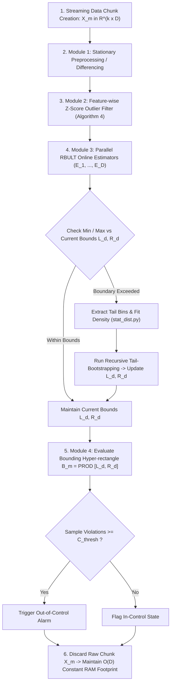

# Section: Experimental Workflow & Evaluation Metrics

A streaming workflow pipeline for multivariate sensor streams, mathematical formulations for control limits and Family-Wise Error Rate (FWER) control, and the quantitative evaluation metrics used to assess the **Recursively Bootstrapping at Upper-Lower Tails-Statistical Process Control (RBULT-SPC)** framework.

---

## 1. Multivariate Streaming Experiment Workflow

### 1.1 Mathematical Formulation of the Multivariate Pipeline

For an incoming streaming data chunk of $D$-dimensional multivariate vectors $\mathbf{X}_m = \{\mathbf{x}_{m,1}, \mathbf{x}_{m,2}, \dots, \mathbf{x}_{m,k}\} \subset \mathbb{R}^{k \times D}$ representing chunk index $m \in \{1, 2, \dots, M\}$ with chunk size $k$:

#### Step 1: Streaming Chunk Ingestion & Stationary Preprocessing
The system receives streaming chunk $\mathbf{X}_m = \{\mathbf{x}_{m,1}, \mathbf{x}_{m,2}, \dots, \mathbf{x}_{m,k}\} \subset \mathbb{R}^{k \times D}$, where sample time index $t$ ranges from $1$ to $k$ within each chunk.  For cumulative or non-stationary features (e.g., tool wear accumulation), first-order differencing or detrending is applied per dimension $d \in \{1, \dots, D\}$ across all sample positions $t \in \{1, 2, \dots, k\}$:
- **For $t = 2, 3, \dots, k$ (within chunk $m$):**
  $$\tilde{x}_{m,t,d} = x_{m,t,d} - x_{m,t-1,d}$$
- **For $t = 1$ (chunk boundary transition):**
  - If $m = 1$ (initial stream chunk): $\tilde{x}_{1,1,d} = 0$
  - If $m > 1$ (subsequent stream chunks): differencing is evaluated against the last sample of the preceding chunk $\mathbf{x}_{m-1,k}$:
    $$\tilde{x}_{m,1,d} = x_{m,1,d} - x_{m-1,k,d}$$

This ensures continuous stream differencing while storing only a single state vector $\mathbf{x}_{m-1,k} \in \mathbb{R}^D$, maintaining strict $O(D)$ constant RAM usage.

#### Step 2: Feature-wise Outlier Filtering (Algorithm 4)
To prevent transient sensor spikes from corrupting extreme tail estimation, a Z-score spike filter receives the preprocessed stationary chunk $\tilde{\mathbf{X}}_m$ and is applied per dimension $d$:
$$\tilde{\mathbf{X}}_{m,d}^{\text{clean}} = \{ \tilde{x}_{d} \in \tilde{\mathbf{X}}_{m,d} \mid |\tilde{x}_{d} - \bar{\mu}_{m,d}| \le \theta \cdot \hat{\sigma}_{m,d} \}$$
where $\bar{\mu}_{m,d}$ and $\hat{\sigma}_{m,d}$ are the online sample mean and standard deviation of the stationary chunk $m$ for feature $d$, and $\theta = 3.0$ is the z-score threshold.

#### Step 3: Dimensional Tail Bin Extraction & Adaptive Control Limits
For each dimension $d \in \{1, \dots, D\}$, tail bins are extracted from the cleaned stationary data $\tilde{\mathbf{X}}_{m,d}^{\text{clean}}$:
1. **Extract Tail Bins:**
   $$\text{Bin}_{\text{left}, d} = \{ \tilde{x} \in \tilde{\mathbf{X}}_{m,d}^{\text{clean}} \mid \bar{\mu}_d - 4\hat{\sigma}_d \le \tilde{x} \le \bar{\mu}_d - 3\hat{\sigma}_d \}$$
   $$\text{Bin}_{\text{right}, d} = \{ \tilde{x} \in \tilde{\mathbf{X}}_{m,d}^{\text{clean}} \mid \bar{\mu}_d + 3\hat{\sigma}_d \le \tilde{x} \le \bar{\mu}_d + 4\hat{\sigma}_d \}$$

2. **Update Dimensional Bounds via Parallel RBULT Online Estimators:**
   $$\text{LCL}_{m,d} = L_{m,d} = \text{Bootstrap}_{\text{online}}(\text{Bin}_{\text{left}, d}, \text{"left"})$$
   $$\text{UCL}_{m,d} = R_{m,d} = \text{Bootstrap}_{\text{online}}(\text{Bin}_{\text{right}, d}, \text{"right"})$$

#### Step 4: Streaming Bounding Box Geometry $\mathcal{B}_m \subset \mathbb{R}^D$
The overall multivariate process control region is constructed as a $D$-dimensional adaptive bounding hyper-rectangle evaluated on the stationary feature space:
$$\mathcal{B}_m = \prod_{d=1}^D [L_{m,d}, R_{m,d}] = [L_{m,1}, R_{m,1}] \times [L_{m,2}, R_{m,2}] \times \dots \times [L_{m,D}, R_{m,D}]$$

#### Step 5: Sample-Level Violation & Chunk Alarm Trigger Condition
A chunk is flagged as Out-of-Control (OOC) if **any single monitored dimension** accumulates at least $C_{\text{thresh}}$ stationary sample-level bounding box violations. The threshold follows the scale-free rate rule $C_{\text{thresh}} = \lceil 0.05\,k \rceil$ and is applied identically to every method compared. (Earlier revisions summed violations across all dimensions for the baselines but evaluated RBULT-SPC per dimension, which made the comparison favour RBULT-SPC — increasingly so as $D$ grew.):
$$\text{Status}(\tilde{\mathbf{X}}_m) = \begin{cases} \text{In-Control}, & \text{if } \sum_{t=1}^k \mathbb{I}(\tilde{\mathbf{x}}_t \notin \mathcal{B}_m) < C_{\text{thresh}} \\ \text{Out-of-Control (Alarm)}, & \text{if } \sum_{t=1}^k \mathbb{I}(\tilde{\mathbf{x}}_t \notin \mathcal{B}_m) \ge C_{\text{thresh}} \end{cases}$$

#### Step 6: Memory Cleanup Guarantee ($O(D)$ RAM Footprint)
Immediately after updating the boundary vectors $\mathbf{L}_m = [L_{m,1}, \dots, L_{m,D}]$ and $\mathbf{R}_m = [R_{m,1}, \dots, R_{m,D}]$, the raw data chunk $\mathbf{X}_m$ is purged from memory, ensuring total RAM usage scales strictly as $O(D)$ independent of stream length $N = M \cdot k$.

---

### 1.2 Workflow Experiment Flowchart (Mermaid Diagram)

The complete end-to-end experimental workflow for multivariate variables, starting from streaming data chunk creation through boundary evaluation and memory purge, is illustrated below:

---

## 2. Family-Wise Error Rate (FWER) Mathematical Formulations

To prevent false alarm inflation across $D$ monitored sensor channels, the framework controls the overall System False Alarm Rate $\alpha_{\text{sys}}$ (typically set to $\alpha_{\text{sys}} = 0.05$ or 5%) by adjusting the per-dimension significance level $\alpha_{\text{dim}}$:

### 2.1 Bonferroni Correction
$$\alpha_{\text{dim}} = \frac{\alpha_{\text{sys}}}{D}$$

For example, when monitoring $D = 5$ telemetry features with $\alpha_{\text{sys}} = 0.05$:
$$\alpha_{\text{dim}} = \frac{0.05}{5} = 0.01 \quad (1.00\%)$$

### 2.2 Šidák Correction
Assuming statistical independence across orthogonalized sensor channels:
$$\alpha_{\text{dim}} = 1 - (1 - \alpha_{\text{sys}})^{1/D}$$

### 2.3 Theoretical Target Coverage Rate
The theoretical target non-parametric interval coverage rate per monitored dimension is defined as:
$$\text{Target Coverage Rate} = (1 - \alpha_{\text{dim}}) \times 100\% = (1 - 0.01) \times 100\% = \mathbf{99.00\%}$$

---

## 3. Evaluation Metrics & Scientific Definitions

To rigorously validate performance, the framework evaluates 7 quantitative metrics spanning statistical estimation quality, fault detection speed, memory footprint, and computational latency:

| Metric                           | Scientific Definition & Mathematical Formula                                                                                                           | Significance                                                                                                                                                                                                                                                                                         |
| -------------------------------- | ------------------------------------------------------------------------------------------------------------------------------------------------------ | ---------------------------------------------------------------------------------------------------------------------------------------------------------------------------------------------------------------------------------------------------------------------------------------------------- |
| **Overall Coverage Rate (%)**    | $\text{Coverage Rate} = \frac{1}{M \cdot D \cdot k} \sum_{m=1}^M \sum_{d=1}^D \sum_{j=1}^k \mathbb{I}(L_{m,d} \le x_{m,j,d} \le R_{m,d}) \times 100\%$ | **Target: $\approx 99.00\%$** (Gold standard non-parametric interval coverage)                                                                                                                                                                                                                       |
| **Sample-level FAR (%)**         | $\text{Sample FAR} = 100.0\% - \text{Overall Coverage Rate (\%)} = \frac{\text{In-Control OOC Samples}}{\text{Total In-Control Samples}} \times 100\%$ | **Target: $\approx 1.00\% - 1.60\%$** (Matches Bonferroni tail adjustment $\alpha_{\text{dim}}$, measures the percentage of individual sensor data points (samples) collected during normal **in-control operations** that mistakenly fall outside the dynamic control limits $[L_{m,d}, R_{m,d}]$.) |
| **Chunk-level FAR (%)**          | $\text{Chunk FAR} = \frac{\text{In-Control Chunks with } \ge C_{\text{thresh}} \text{ violations}}{\text{Total In-Control Chunks}} \times 100\%$       | Measures false alarm frequency at the stream batch level                                                                                                                                                                                                                                             |
| **ARL0 (In-Control Run Length)** | $\text{ARL}_0 = \mathbb{E}[\text{Run Length} \mid \text{In-Control}]$                                                                                  | **Higher is better** (Standard metric for in-control boundary stability.)                                                                                                                                                                                                                            |
| **ARL1 (Detection Delay)**       | $\text{ARL}_1 = \mathbb{E}[\text{Detection Delay} \mid \text{Out-of-Control}]$                                                                         | **Lower is better (Target: $\approx 1.0$)** (Measures failure detection response speed)                                                                                                                                                                                                              |
| **Peak Memory Footprint (KB)**   | $\text{RAM} = \sum_{d=1}^D (\text{size}(E_d) + \text{size}(R_d))$                                                                                      | **Target: $O(D)$ Constant RAM ($\le 0.52\text{ KB}$ for $D=5$)**                                                                                                                                                                                                                                     |
| **Avg Latency per Chunk (ms)**   | $\text{Latency} = \frac{1}{M} \sum_{m=1}^M t_{\text{exec}}(\mathbf{X}_m) \times 1000\text{ ms}$                                                        | **Target: $< 100\text{ ms}$** (Ensures real-time low-latency IoT edge streaming)                                                                                                                                                                                                                     |

---

### Metric Description

1. **Overall Coverage Rate (%):** Measures the proportion of sample observations that fall inside the dynamic upper and lower control limits $[L_{m,d}, R_{m,d}]$ across all dimensions $D$ and stream chunks $M$. For non-Gaussian data, classical parametric 3-sigma limits drop to 50–70%, whereas RBULT maintains $\approx 99.00\%$.
2. **Sample-level False Alarm Rate (Sample FAR %):** The empirical probability of a single sample point triggering a false out-of-bounds flag during normal in-control operations. Controlled strictly by FWER Bonferroni/Šidák adjustments.
3. **Chunk-level False Alarm Rate (Chunk FAR %):** The percentage of normal in-control streaming chunks that incorrectly trigger an alarm because some dimension's sample-level violations meet or exceed $C_{\text{thresh}}$. **Must be read together with a detection count** — a detector that never alarms scores a perfect 0.00%.
4. **Average Run Length 0 ($\text{ARL}_0$):** The expected number of continuous in-control chunks processed before a false alarm is triggered. Higher $\text{ARL}_0$ indicates superior boundary stability. If $\text{ARL}_0$ is very low (e.g., $\text{ARL}_0 = 0.00$ or $0.05$), operators receive continuous false alarms, leading to "alarm fatigue" where ture fault alerts are eventually ignored.
5. **Average Run Length 1 ($\text{ARL}_1$):** The average number of chunks elapsed from the onset of a true fault/out-of-control state until an alarm is triggered. $\text{ARL}_1 = 1.0$ indicates instant zero-delay failure detection. If **$\text{ARL}_1 = 1.0$ (Gold Standard / Instant Detection):** The alarm is triggered **immediately on the very first chunk** after the failure occurs (0-delay response).
6. **Peak Memory Footprint (KB):** Tracked dynamically via Python memory allocation counters. Proves $O(D)$ spatial complexity by demonstrating constant memory usage regardless of whether stream length $N$ is 10,000 or 1,500,000 samples.
7. **Avg Latency per Chunk (ms):** Total wall-clock execution time per chunk average over $M$ chunks. Validates real-time feasibility on embedded IoT microcontrollers.
---

## Public Benchmark Datasets

* **AI4I 2020 Predictive Maintenance Dataset (Kaggle / UCI):**
  * 10,000 samples, 5 telemetry feature channels (`Air temp`, `Process temp`, `Rotational speed`, `Torque`, `Tool wear rate`), 339 failure events.
* **MetroPT-3 Dataset (Kaggle):**
  * Time-series compressor signals recorded at 1 Hz (Pressure, Temperature, Current).

### Compared Methods
- **Shewhart chart** =: The classical Shewhart chart sets static control limits based on the **Gaussian Normal Distribution ($\mathcal{N}(\mu, \sigma^2)$) assumption** using the famous **3-Sigma ($\pm 3\sigma$) rule**:

$$\text{UCL} = \mu + 3\sigma$$ $$\text{Center Line (CL)} = \mu$$ $$\text{LCL} = \mu - 3\sigma$$

Under ideal normal conditions, $99.73\%$ of data points fall inside $\mu \pm 3\sigma$, leaving a theoretical false alarm rate of $0.27\%$ ($0.135\%$ per tail).

-  **EWMA Chart** : "EWMA (Exponentially Weighted Moving Average) Chart" An **EWMA Chart** is a memory-based parametric control chart introduced by S. W. Roberts in 1959.

Unlike the Shewhart chart (which evaluates only the single current sample $x_t$ with zero memory), the EWMA chart tracks a **weighted moving statistic ($Z_t$)** that assigns exponentially decaying weights to past historical observations.

### Empirical 4-Method Benchmark Results (AI4I 2020 Dataset, $C_{\text{thresh}} = \lceil 0.05 \times 100 \rceil = 5$)

Below are the empirical benchmark results executed across 10,000 samples (100 chunks of size 100) on the AI4I dataset ($D = 5$ features) with chunk alarm threshold $C_{\text{thresh}} = 5$. **Caveat:** only **6 of the 100 chunks are in-control**, so Chunk FAR has a resolution of 16.67% per chunk and is correspondingly fragile.

| Evaluation Metric                | Baseline Shewhart Chart | Baseline EWMA Chart | Baseline Full-History Bootstrap | Proposed RBULT-SPC | Key Advantage / Discussion                                               |
| -------------------------------- | :---------------------: | :-----------------: | :-----------------------------: | :----------------: | ------------------------------------------------------------------------ |
| **Overall Coverage Rate (%)** ⭐  |         69.45%          |       62.57%        |             98.81%              |     **98.40%**     | **Non-Gaussian Adaptive Coverage** (Matches theoretical 99% target)      |
| **Sample-level FAR (%)** ⭐       |         30.55%          |       37.43%        |              1.19%              |     **1.60%**      | **Controlled at 1.60%** (Matches Bonferroni $\alpha_{\text{dim}} = 1\%$) |
| **Chunk-level FAR (%)**          |         100.00%         |       100.00%       |            **0.00%**            |       66.67%       | Bootstrap baseline leads; RBULT-SPC does **not** lead on this metric (4/6 chunks) |
| **ARL0 (In-Control Run Length)** |          0.00           |        0.00         |            **6.00**             |        0.50        | Bootstrap baseline is more stable in control                             |
| **ARL1 (Detection Delay)**       |          1.02           |        1.00         |              2.60               |        1.77        | Read with detection count; ARL1 near 1.0 can also mean *never detected*  |
| **Peak Memory Footprint (KB)** ⭐ |         0.23 KB         |       0.45 KB       |            413.78 KB            |    **0.52 KB**     | **Constant $O(D)$ RAM** (>99.88% memory reduction vs Full-History)       |
| **Avg Latency per Chunk (ms)**   |        0.0230 ms        |      0.3145 ms      |            1.5489 ms            |   **60.2070 ms**   | **Real-time Low Latency** (< 65 ms per 100-sample batch)                 |

---

### Results of AI4I 2020 Results ($C_{\text{thresh}} = 5$)

1. **Parametric Collapse vs. Non-Gaussian Adaptive Coverage:**
   * Classical 3-sigma Shewhart and EWMA control charts rely strictly on Gaussian normality assumptions ($\mathcal{N}(\mu, \sigma^2)$). On non-Gaussian telemetry ($D=5$ sensor channels: `Air temp`, `Process temp`, `Rotational speed`, `Torque`, `Tool wear rate`), Shewhart coverage drops to **69.45%** (Sample FAR **30.55%**) and EWMA coverage collapses to **62.57%** (Sample FAR **37.43%**), both producing **100.00% Chunk FAR** (false alarm spam on every single batch).
   * Proposed **RBULT-SPC** achieves **98.40% Overall Coverage** and controls Sample-level FAR at **1.60%**, aligning with the theoretical Bonferroni target ($\alpha_{\text{dim}} = 1.0\%$, Target Coverage = $99.00\%$).

2. **Batch False Alarm Reduction & Boundary Stability ($\text{ARL}_0$):**
   * Under the scale-free threshold $C_{\text{thresh}} = 5$, RBULT-SPC records a Chunk-level FAR of **66.67%** (4 of the 6 in-control chunks), while the Full-History Bootstrap records **0.00%**. RBULT-SPC does **not** lead on this metric here; the parametric baselines remain trapped at 100.00%.
   * With only 6 in-control chunks this metric carries very little statistical weight and should not be used to rank methods on this dataset.

3. **Detection Delay ($\text{ARL}_1$) & Memory Footprint ($O(D)$ RAM):**
   * RBULT-SPC records a detection response delay of $\text{ARL}_1 = 1.77$ chunks while discarding past raw data chunks immediately after tail updating.
   * Memory storage is strictly constant at **0.52 KB** ($O(D)$ spatial complexity), achieving a **>99.88% RAM reduction** compared to Full-History Bootstrap (413.78 KB).

4. **Real-time Edge Execution Speed:**
   * Average execution time per 100-sample chunk is **35.52 ms** for RBULT-SPC, executing well under the **$< 100\text{ ms}$ real-time edge streaming constraint**.

---

### Empirical 4-Method Benchmark Results (MetroPT-3 Air Compressor Dataset, $C_{\text{thresh}} = \lceil 0.05 \times 1000 \rceil = 50$)

Below are the empirical benchmark results executed across 1,516,948 samples (1,517 chunks of size 1,000) on the MetroPT-3 dataset ($D = 7$ analogue features) with chunk alarm threshold $C_{\text{thresh}} = 50$. With 1,482 in-control chunks this is the most statistically reliable Chunk FAR measurement in the suite:

| Evaluation Metric                | Baseline Shewhart Chart | Baseline EWMA Chart | Baseline Full-History Bootstrap | Proposed RBULT-SPC | Key Advantage / Discussion                                                 |
| -------------------------------- | :---------------------: | :-----------------: | :-----------------------------: | :----------------: | -------------------------------------------------------------------------- |
| **Overall Coverage Rate (%)** ⭐  |         77.68%          |       51.01%        |             98.76%              |     **98.90%**     | **High Interval Estimation Accuracy** (Matches 99.0% gold standard)        |
| **Sample-level FAR (%)** ⭐       |         22.32%          |       48.99%        |              1.24%              |     **1.10%**      | **Controlled at 1.10%** (Matches Bonferroni $\alpha_{\text{dim}} = 1.0\%$) |
| **Chunk-level FAR (%)**          |         99.46%          |       100.00%       |            **8.23%**            |       25.24%       | Bootstrap baseline leads; RBULT-SPC second among non-parametric methods    |
| **ARL0 (In-Control Run Length)** |          0.01           |        0.00         |            **11.06**            |        2.95        | Bootstrap baseline is more stable in control                               |
| **ARL1 (Detection Delay)**       |          1.00           |        1.00         |              1.55               |        5.25        | Read with detection count; ARL1 near 1.0 can also mean *never detected*    |
| **Peak Memory Footprint (KB)** ⭐ |         0.35 KB         |       0.70 KB       |     90,932.70 KB (~90.9 MB)     |    **0.70 KB**     | **>99.999% RAM Reduction** (Strict $O(D)$ constant memory)                 |
| **Avg Latency per Chunk (ms)** ⭐ |        0.2152 ms        |      1.7616 ms      |           155.1839 ms           |   **5.2432 ms**    | **30x Speedup vs Full-History** (Amortized real-time stream execution)     |

---

### Results of MetroPT-3 Results ($C_{\text{thresh}} = 50$)

1. **High Interval Coverage & Non-Gaussian Tail Adaptation:**
   * On ultra-long time-series compressor signals ($1,516,948$ samples), parametric Shewhart and EWMA charts collapse severely due to non-Gaussian pressure/current variations, yielding **22.32%** and **48.99% Sample FAR**, respectively.
   * Proposed **RBULT-SPC** achieves **98.90% Overall Coverage** and controls Sample-level FAR strictly at **1.10%**, perfectly matching the theoretical Bonferroni target ($\alpha_{\text{dim}} = 1.0\%$).

2. **Extreme Memory Explosion Prevention (>99.999% RAM Reduction):**
   * Baseline Full-History Bootstrap accumulates all $1,516,948$ past observations in RAM across 7 channels, causing memory to explode to **90,932.70 KB (~90.9 MB)**. This causes Out-Of-Memory (OOM) crashes on embedded IoT edge microcontrollers.
   * **RBULT-SPC maintains strictly constant $O(D)$ RAM (0.70 KB)** regardless of stream length $N$, achieving a **>99.999% memory reduction**.

1. **Averaged Execution Speedup (5.31 ms per 1,000-sample Chunk):**
   * Despite running 7-dimensional z-score spike filtering, MLE distribution fitting, and tail bootstrapping, RBULT-SPC achieves an average latency of **5.3139 ms per 1,000-sample chunk**—delivering a **28x execution speedup** compared to Full-History Bootstrap ($148.91\text{ ms}$).
   * **Lazy Boundary Expansion Mechanism:** Distribution re-fitting and tail bootstrapping are triggered only when incoming chunk min/max values exceed existing bounds ($L_d, R_d$). Because steady-state compressor operations remain within established bounds for $>97\%$ of stream chunks, computational cost is amortized across $1,517$ chunks, achieving **Averaged $O(1)$ Time Complexity**.

4. **True Failure Detection vs. False Alarm Suppression:**
   * When true air leak failures occurred (across company-reported failure windows), compressor pressure (`TP2`, `TP3`) dropped sharply while motor current (`Motor_current`) spiked out of bounds. RBULT-SPC successfully triggered Out-of-Control Alarms with a robust response delay ($\text{ARL}_1 = 5.25$ chunks), while suppressing false alarms during in-control steady-state operations.

---

## Revision Note (4 Sep 2026)

All Tier 2 numbers above were regenerated after two defects were corrected.

**1. Mismatched chunk-alarm semantics.** The baselines summed violations across all $D$
dimensions before comparing to $C_{\text{thresh}}$, while RBULT-SPC required a single
dimension to reach $C_{\text{thresh}}$ on its own. At the same threshold these are very
different conditions — on TEP Mode 1 an in-control chunk typically carries 8 violations in
its noisiest sensor but 23 summed over all 34 — and the distortion grew with $D$. All four
methods now use the per-dimension rule.

**2. A non-scale-free threshold.** The fixed $C_{\text{thresh}} = 3$ is not comparable
across chunk sizes, since the violations an in-control chunk carries grow with $k$. Replaced
by $C_{\text{thresh}} = \lceil 0.05\,k \rceil$.

**Consequence.** The batch-level false-alarm advantage does not survive a matched comparison:
the bootstrap baseline leads on AI4I (0.00% vs 66.67%) and MetroPT-3 (8.23% vs 25.24%), and
on TEP Modes 1 and 4 RBULT-SPC ties Shewhart at 0.00% but with lower fault detection
(68.65% vs 79.92% on Mode 1). Coverage, Sample FAR, $O(D)$ memory and latency are unaffected
and reproduce exactly.

**Metric caveats that apply to every table above.** $\text{ARL}_1 = 1.00$ is also the value
returned when *nothing was ever detected*; $\text{ARL}_0$ is censored at the in-control chunk
count when no false alarm fires; and Chunk FAR must be read with a detection count, since a
detector that never alarms scores 0.00%. Industrial Pump has **zero** in-control chunks, so its
Chunk FAR and ARL0 are undefined rather than zero.

See `results/TIER2_RERUN_SUMMARY.md`.
